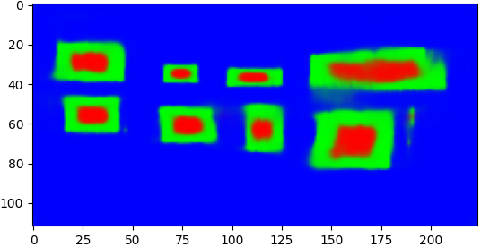

# Handwritten Word Detector

A neural network based detector for handwritten words.

## Run demo
* Download [trained model](https://www.dropbox.com/s/mqhco2q67ovpfjq/model.zip?dl=1), and place the unzipped files into the `model` directory
* Go to the `src` directory and execute `python infer.py`
* This opens a window showing the detected words detected in the test images (located in `data/test`)
* Required libs: torch, numpy, sklearn, cv2, path, matplotlib

## Train model
### Data
* The model is trained with the [IAM dataset](https://fki.tic.heia-fr.ch/databases/iam-handwriting-database)
* Download the forms and the xml files
* Create a dataset directory on your disk with two subdirectories: `gt` and `img`
* Put all form images into the `img` directory
* Put all xml files into the `gt` directory
 
### Start training
* Go to `src` and execute `python train.py` with the following parameters specified (only the first one is required):
  * `--data_dir`: dataset directory containing a `gt` and an `img` directory
  * `--batch_size`: 27 images per batch are possible on a 8GB GPU 
  * `--caching`: cache the dataset to avoid loading and decoding the png images, cache file is stored in the dataset directory
  * `--pretrained`: initialize with saved model weights 
  * `--val_freq`: speed up training by only validating each n-th epoch
* The model weights are saved every time the validation loss decreases
* A log is written into the `log` directory, which can be opened with tensorboard
* The training loop is an infinite loop, so you manually have to kill the process when you don't see any more improvement (e.g. by looking at tensorboard)
* Executing `python eval.py` evaluates the trained model

## Information about model
* The model classifies each pixel into one of three classes (see plot below):
  * Inner part of a word (plot: red)
  * Outer part of a word (plot: green)
  * Background (plot: blue)
* An axis-aligned bounding box is predicted for each inner-word pixel
* DBSCAN clusters the predicted bounding boxes
* The backbone of the neural network is based on the ResNet18 model (taken from torchvision, with modifications)
* The model is inspired by the ideas of [Zhou](https://openaccess.thecvf.com/content_cvpr_2017/papers/Zhou_EAST_An_Efficient_CVPR_2017_paper.pdf) and [Axler](http://www.cs.tau.ac.il/~wolf/papers/dataset-agnostic-word.pdf)

